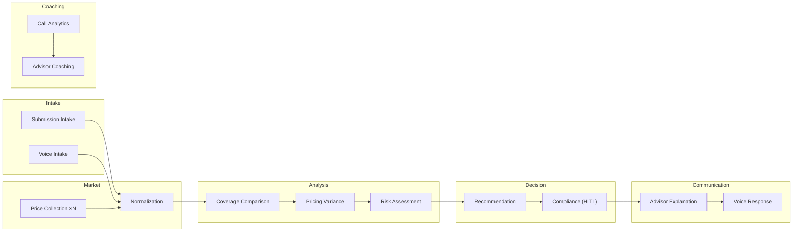

# Agent Reference

Quick reference for all 14 agents in the Insurance Competitive Quote Intelligence system.

---

## Agent Overview



---

## Agent Catalog

| # | Agent | Model | Role | Input | Output | Pattern |
|---|-------|-------|------|-------|--------|---------|
| 1 | **Orchestrator** | GPT-4o | Routes requests to specialist agents and composes the final response | Raw user input (text/voice/doc) | `QuoteIntelligenceResult` | Handoff → Sequential |
| 2 | **Submission Intake** | GPT-4o-mini | Parses text/JSON/email submissions into a structured risk profile | Raw text or JSON | `SubmissionRecord` | Sequential |
| 3 | **Voice Intake** | GPT-4o-mini | Converts speech transcripts into a structured risk profile | Speech-to-text transcript | `SubmissionRecord` | Sequential |
| 4 | **Price Collection** | GPT-4o-mini | Fans out to N competitor APIs and aggregates market quotes | `SubmissionRecord` | `list[NormalizedQuote]` | Concurrent |
| 5 | **Normalization** | GPT-4o-mini | Standardizes diverse quote formats into a common schema | Raw competitor responses | `list[NormalizedQuote]` | Sequential |
| 6 | **Coverage Comparison** | GPT-4o | Builds side-by-side comparison matrix across all carriers | Carrier + competitor quotes | `ComparisonMatrix` | Sequential |
| 7 | **Pricing Variance** | GPT-4o | Calculates market position, rate adequacy, and sweet-spot pricing | `ComparisonMatrix` | `PricingVariance` | Sequential |
| 8 | **Risk Assessment** | GPT-4o | Scores appetite match and exposure using RAG over underwriting manuals | `SubmissionRecord` + AI Search results | `RiskAssessment` | Magentic (capped) |
| 9 | **Recommendation** | GPT-4o | Proposes rate action (hold/reduce/increase) within guardrail bands | `PricingVariance` + `RiskAssessment` | `Recommendation` | Sequential |
| 10 | **Compliance Guardrail** | GPT-4o | Validates against regulations; requires human approval before proceeding | `Recommendation` | `ComplianceResult` | HITL (always_require) |
| 11 | **Advisor Explanation** | GPT-4o-mini | Generates plain-language talk-track for the advisor to use with the client | All pipeline outputs | Plain text explanation | Sequential |
| 12 | **Voice Response** | GPT-4o-mini | Formats explanation for text-to-speech output (SSML-optimized) | Advisor explanation text | SSML-formatted speech | Sequential |
| 13 | **Call Analytics** | GPT-4o-mini | Analyzes call transcripts for conversion patterns and objection handling | Call transcript + metadata | Analytics JSON | Async batch |
| 14 | **Advisor Coaching** | GPT-4o | Generates personalized coaching reports from aggregated performance data | Analytics results + KPIs | Coaching report | Async batch |

---

## Agent Details

### 1. Orchestrator

| Property | Value |
|----------|-------|
| **Entry Point** | `src.agents.orchestrator:QuoteIntelligenceOrchestrator` |
| **Model** | GPT-4o |
| **Tools Used** | None (delegates to agents) |
| **Key Behavior** | Inspects input modality, selects pipeline (text/voice/coaching), manages error recovery |
| **Guardrails** | Max pipeline duration: 30s; fallback to partial results if timeout |

### 2. Submission Intake

| Property | Value |
|----------|-------|
| **Entry Point** | `src.agents.intake.submission_intake:SubmissionIntakeAgent` |
| **Model** | GPT-4o-mini |
| **Tools Used** | `quote_parser`, `content_understanding` |
| **Key Behavior** | Extracts structured fields from free-text; flags missing fields for follow-up |
| **Guardrails** | Must populate all required `SubmissionRecord` fields or list them in `missing_fields` |

### 3. Voice Intake

| Property | Value |
|----------|-------|
| **Entry Point** | `src.agents.intake.voice_intake:VoiceIntakeAgent` |
| **Model** | GPT-4o-mini |
| **Tools Used** | `realtime_transcription`, `diarization`, `translation` |
| **Key Behavior** | Processes real-time speech; identifies key entities from conversational language |
| **Guardrails** | Minimum confidence threshold for STT: 0.7; requests clarification below threshold |

### 4. Price Collection

| Property | Value |
|----------|-------|
| **Entry Point** | `src.agents.market_intelligence.price_collection:CompetitorPriceCollectionAgent` |
| **Model** | GPT-4o-mini |
| **Tools Used** | `competitor_api`, `market_data` |
| **Key Behavior** | Concurrent fan-out to N sources; tolerates partial failure (min 2 responses) |
| **Guardrails** | Timeout per source: 5s; total timeout: 10s; no proprietary data sent to competitors |

### 5. Normalization

| Property | Value |
|----------|-------|
| **Entry Point** | `src.agents.market_intelligence.normalization:QuoteNormalizationAgent` |
| **Model** | GPT-4o-mini |
| **Tools Used** | None (pure transformation) |
| **Key Behavior** | Maps heterogeneous quote formats to `NormalizedQuote` schema |
| **Guardrails** | All monetary values converted to common currency; missing fields set to null (not zero) |

### 6. Coverage Comparison

| Property | Value |
|----------|-------|
| **Entry Point** | `src.agents.analysis.coverage_comparison:CoverageComparisonAgent` |
| **Model** | GPT-4o |
| **Tools Used** | `operational_datastore` |
| **Key Behavior** | Builds multi-dimensional comparison matrix; identifies "apples-to-apples" adjustments |
| **Guardrails** | Must compare on minimum 8 dimensions; flags non-comparable coverage forms |

### 7. Pricing Variance

| Property | Value |
|----------|-------|
| **Entry Point** | `src.agents.analysis.pricing_variance:PricingVarianceAgent` |
| **Model** | GPT-4o |
| **Tools Used** | `operational_datastore` |
| **Key Behavior** | Computes market position rank, adequacy verdict (GREEN/AMBER/RED), sweet-spot |
| **Guardrails** | Variance calculation: `(carrier - median) / median × 100`; must validate denominator ≠ 0 |

### 8. Risk Assessment

| Property | Value |
|----------|-------|
| **Entry Point** | `src.agents.analysis.risk_assessment:RiskAssessmentAgent` |
| **Model** | GPT-4o |
| **Tools Used** | `ai_search`, `operational_datastore` |
| **Key Behavior** | RAG-based research into underwriting manuals; scores appetite and exposure |
| **Guardrails** | Max 3 search iterations (Magentic cap); exposure score must be 1-10 scale |

### 9. Recommendation

| Property | Value |
|----------|-------|
| **Entry Point** | `src.agents.decision.recommendation:RecommendationAgent` |
| **Model** | GPT-4o |
| **Tools Used** | None (pure reasoning) |
| **Key Behavior** | Proposes rate action within configurable guardrail bands (default ±15%) |
| **Guardrails** | **Cannot recommend adjustment > guardrail_band_used**; must provide ≥1 rationale |

### 10. Compliance Guardrail (HITL)

| Property | Value |
|----------|-------|
| **Entry Point** | `src.agents.decision.compliance_guardrail:ComplianceGuardrailAgent` |
| **Model** | GPT-4o |
| **Tools Used** | None (policy evaluation) |
| **Key Behavior** | Validates antitrust, rate filing, regulatory, and data governance compliance |
| **Guardrails** | **Always requires human approval** (`approval_mode: always_require`); blocks if any check fails |

### 11. Advisor Explanation

| Property | Value |
|----------|-------|
| **Entry Point** | `src.agents.communication.advisor_explanation:AdvisorExplanationAgent` |
| **Model** | GPT-4o-mini |
| **Tools Used** | None (text generation) |
| **Key Behavior** | Generates concise, jargon-free talk-track for advisor-to-client conversation |
| **Guardrails** | Max 200 words; must not disclose competitor names to client; conversational tone |

### 12. Voice Response

| Property | Value |
|----------|-------|
| **Entry Point** | `src.agents.communication.voice_response:VoiceResponseAgent` |
| **Model** | GPT-4o-mini |
| **Tools Used** | `text_to_speech` |
| **Key Behavior** | Converts explanation to SSML-formatted speech; handles prosody and emphasis |
| **Guardrails** | Max 30 seconds of speech; natural pacing; no sensitive data in audio |

### 13. Call Analytics

| Property | Value |
|----------|-------|
| **Entry Point** | `src.agents.coaching.call_analytics:CallAnalyticsAgent` |
| **Model** | GPT-4o-mini |
| **Tools Used** | `call_summarization`, `call_recording`, `disposition_codes` |
| **Key Behavior** | Analyzes completed call transcripts; identifies patterns, objections, conversion signals |
| **Guardrails** | Runs async (post-call); PII redaction before analysis; batch processing |

### 14. Advisor Coaching

| Property | Value |
|----------|-------|
| **Entry Point** | `src.agents.coaching.advisor_coaching:AdvisorCoachingAgent` |
| **Model** | GPT-4o |
| **Tools Used** | `fabric_analytics` |
| **Key Behavior** | Aggregates analytics across calls; generates personalized improvement recommendations |
| **Guardrails** | Weekly batch cadence; coaching tone (not punitive); compares to anonymized team benchmarks |

---

## Tools Reference

| Tool | Module | Used By | Azure Service |
|------|--------|---------|---------------|
| `realtime_transcription` | `src.tools.speech.realtime_transcription` | Voice Intake | Azure AI Speech |
| `text_to_speech` | `src.tools.speech.text_to_speech` | Voice Response | Azure AI Speech |
| `translation` | `src.tools.speech.translation` | Voice Intake | Azure AI Translator |
| `call_summarization` | `src.tools.speech.call_summarization` | Call Analytics | Azure AI Speech |
| `diarization` | `src.tools.speech.diarization` | Voice Intake | Azure AI Speech |
| `quote_parser` | `src.tools.documents.quote_parser` | Submission Intake | Azure AI Document Intelligence |
| `content_understanding` | `src.tools.documents.content_understanding` | Submission Intake | Azure AI Document Intelligence |
| `operational_datastore` | `src.tools.data.operational_datastore` | Coverage, Variance, Risk | Azure SQL / Cosmos DB |
| `ai_search` | `src.tools.data.operational_datastore` | Risk Assessment | Azure AI Search |
| `fabric_analytics` | `src.tools.data.operational_datastore` | Advisor Coaching | Microsoft Fabric |
| `competitor_api` | `src.tools.market.competitor_api` | Price Collection | Azure API Management |
| `market_data` | `src.tools.market.competitor_api` | Price Collection | Azure API Management |
| `call_recording` | `src.tools.contact_center.call_recording` | Call Analytics | Azure Communication Services |
| `disposition_codes` | `src.tools.contact_center.call_recording` | Call Analytics | Azure Communication Services |

---

## Customizing Agents

### Adding a New Agent

1. Create a new Python class in `src/agents/<category>/`:
   ```python
   from agent_framework import Agent

   class MyNewAgent(Agent):
       name = "my-new-agent"
       model = "gpt-4o-mini"
       system_prompt = """Your instructions here."""

       async def run(self, context):
           # Your logic
           pass
   ```

2. Register in `agent.yaml`:
   ```yaml
   - name: my-new-agent
     entry_point: src.agents.category.my_module:MyNewAgent
     model: gpt-4o-mini
   ```

3. Add to the appropriate workflow in `src/workflows/`.

### Modifying an Existing Agent

- **Change the model**: Update the `model` field in `agent.yaml` and the class
- **Change behavior**: Edit the `system_prompt` in the agent class
- **Change guardrails**: Modify the validation logic in the agent's `run()` method
- **Add a tool**: Create in `src/tools/`, register in `agent.yaml` tools section

### Insurance Line Customization

The template is designed for **commercial P&C insurance** but can be adapted:

| Target Line | Changes Needed |
|-------------|---------------|
| Personal Lines (auto, home) | Simplify `SubmissionRecord`, reduce competitor count |
| Life & Health | Replace `ProductType` enum, add medical underwriting agent |
| Reinsurance | Add treaty/facultative distinction, larger limits |
| Specialty (marine, aviation) | Add specialist risk agents, different data sources |
