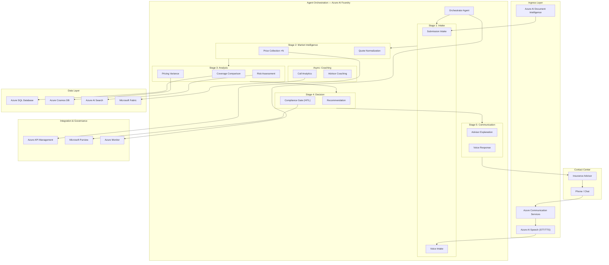
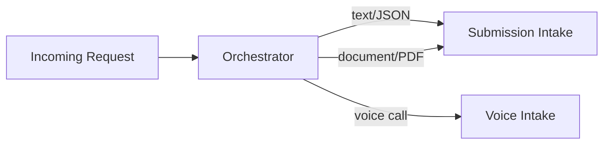
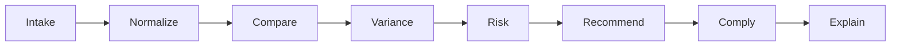
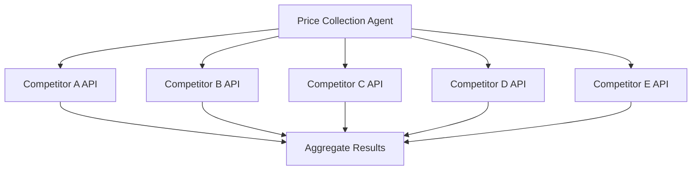
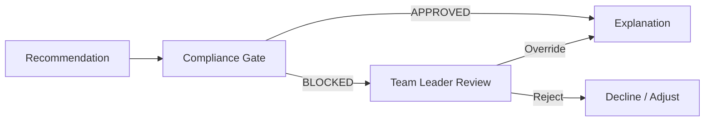

# Architecture

## System Overview

The Insurance Competitive Quote Intelligence Accelerator is a **multi-agent AI system** designed for insurance contact centers. It coordinates 14 specialist agents across 5 orchestration patterns to deliver real-time competitive quote analysis during advisor–client conversations.

The system runs entirely on **Microsoft Azure**, leveraging Azure AI Foundry for agent hosting, Azure OpenAI for reasoning, and Azure Communication Services for voice integration.

---

## High-Level Architecture



---

## Orchestration Patterns

The system uses **5 distinct orchestration patterns** provided by the Microsoft Agent Framework:

### 1. Handoff (Triage)



The Orchestrator inspects the input modality and delegates to the appropriate intake agent. This is a **zero-latency routing decision** — no LLM call needed for triage.

### 2. Sequential (Pipeline)



The core pipeline flows sequentially: each agent's output becomes the next agent's input. The Pydantic schemas in `src/models/schemas.py` define the contracts between each step.

### 3. Concurrent (Fan-Out / Fan-In)



The Price Collection agent fans out to N competitor data sources **simultaneously** via Azure API Management. Partial failures are tolerated (minimum 2 of N responses required).

### 4. Magentic (Capped Discovery)

Used by the Risk Assessment agent for open-ended research against the Azure AI Search index (underwriting manuals, loss history). The agent iterates until it finds sufficient evidence or hits the **round cap** (default: 3 iterations).

### 5. Human-in-the-Loop (HITL) Gate



The Compliance Guardrail agent **always requires human approval** (`approval_mode: always_require`) before any rate recommendation is communicated. This ensures regulatory compliance and provides an audit trail via Microsoft Purview.

---

## Data Flow

| Step | Input | Output | Schema |
|------|-------|--------|--------|
| 1. Intake | Raw text / voice transcript / PDF | `SubmissionRecord` | Structured risk profile |
| 2. Price Collection | `SubmissionRecord` | `list[NormalizedQuote]` | N competitor quotes |
| 3. Normalization | Raw quote responses | `list[NormalizedQuote]` | Standardized format |
| 4. Coverage Comparison | Carrier + competitor quotes | `ComparisonMatrix` | Side-by-side analysis |
| 5. Pricing Variance | `ComparisonMatrix` | `PricingVariance` | Market position |
| 6. Risk Assessment | `SubmissionRecord` + search results | `RiskAssessment` | Appetite & exposure |
| 7. Recommendation | Variance + Risk | `Recommendation` | Rate action |
| 8. Compliance | `Recommendation` | `ComplianceResult` | Approved / Blocked |
| 9. Explanation | All above | Plain-language talk-track | Advisor-ready text |

---

## Azure Services Map

```
┌─────────────────────────────────────────────────────────────────────┐
│ STAGE 1: Core AI (No credentials required)                          │
├─────────────────────────────────────────────────────────────────────┤
│ Azure AI Foundry          │ Agent hosting & orchestration           │
│ Azure OpenAI (GPT-4o)    │ Agent reasoning (all 14 agents)         │
│ Azure AI Search           │ RAG over underwriting manuals           │
│ Azure AI Speech           │ Real-time STT/TTS for voice flow        │
│ Azure AI Document Intel.  │ PDF/image quote parsing (OCR)           │
│ Azure AI Content Safety   │ Input/output guardrails                 │
│ Azure AI Translator       │ Multi-language support                  │
│ Azure Monitor + App Ins.  │ Observability & OpenTelemetry traces    │
│ Azure Key Vault           │ Secrets management                      │
│ Azure Managed Identity    │ Zero-credential service auth            │
├─────────────────────────────────────────────────────────────────────┤
│ STAGE 2: Data Layer (Requires SQL admin password)                   │
├─────────────────────────────────────────────────────────────────────┤
│ Azure SQL Database        │ Operational store (submissions, quotes) │
│ Azure Cosmos DB           │ Real-time quote cache & session state   │
│ Microsoft Fabric          │ Analytics & historical reporting        │
├─────────────────────────────────────────────────────────────────────┤
│ STAGE 3: Integration & Governance (Requires APIM email)             │
├─────────────────────────────────────────────────────────────────────┤
│ Azure API Management      │ Competitor API gateway & rate limiting  │
│ Azure Communication Svcs  │ Voice/SMS/email channel management      │
│ Microsoft Purview         │ Data governance & compliance audit      │
│ Azure Event Grid          │ Event-driven agent triggers             │
└─────────────────────────────────────────────────────────────────────┘
```

---

## Security & Identity

- **Managed Identity**: Every agent and Azure service communicates via Entra ID managed identity — no secrets in code
- **Key Vault**: External secrets (competitor API keys) stored in Key Vault, accessed via managed identity
- **RBAC**: Least-privilege role assignments defined in `infra/modules/governance/`
- **Network**: Optional VNet integration for enterprise deployments (not enabled by default)
- **Audit**: All HITL decisions logged to Microsoft Purview for regulatory audit

---

## Deployment Topology

The system deploys as a **single resource group** with modular stages:

```
Resource Group: rg-quote-intelligence-{env}
├── Stage 1: Core AI (always deployed)
│   ├── Azure AI Foundry Hub + Project
│   ├── Azure OpenAI (GPT-4o + GPT-4o-mini deployments)
│   ├── Azure AI Search (Basic SKU)
│   ├── Azure AI Speech
│   ├── Azure AI Document Intelligence
│   ├── Key Vault
│   ├── Application Insights + Log Analytics
│   └── Storage Account (agent state)
├── Stage 2: Data (optional)
│   ├── Azure SQL Database (S1)
│   ├── Azure Cosmos DB (serverless)
│   └── Microsoft Fabric Workspace
└── Stage 3: Integration (optional)
    ├── Azure API Management (Standard v2)
    ├── Azure Communication Services
    ├── Microsoft Purview
    └── Azure Event Grid
```

---

## Performance Characteristics

| Metric | Target | Notes |
|--------|--------|-------|
| End-to-end latency (text) | < 8 seconds | Intake → Recommendation |
| End-to-end latency (voice) | < 12 seconds | Includes STT/TTS |
| Price Collection (5 competitors) | < 3 seconds | Concurrent fan-out |
| HITL approval wait | Variable | Depends on team leader response time |
| Concurrent advisors supported | 50+ | Foundry Hosted Agents auto-scale |

---

## Extensibility Points

| Extension | How | Example |
|-----------|-----|---------|
| Add a new agent | Create class in `src/agents/`, register in `agent.yaml` | Fraud detection agent |
| Add a competitor source | Create tool in `src/tools/market/`, configure in APIM | Lloyd's syndicate feed |
| Add a product line | Extend `ProductType` enum in `src/models/schemas.py` | Marine cargo |
| Change orchestration pattern | Modify `src/workflows/` pipeline definitions | Add parallel risk checks |
| Add a language | Configure Azure AI Translator in agent system prompts | French, Spanish |
| Connect to existing data | Update `src/tools/data/operational_datastore.py` | Connect to Guidewire |
